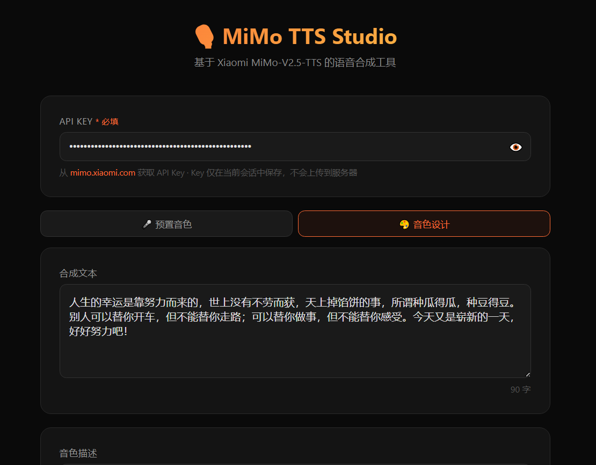
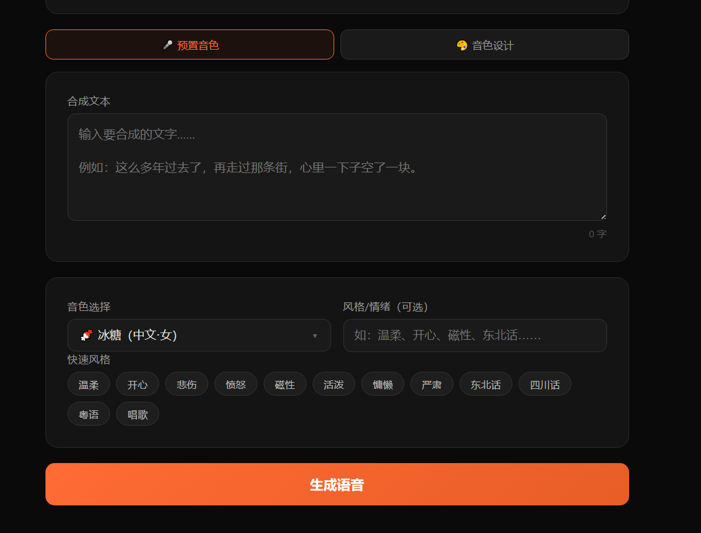
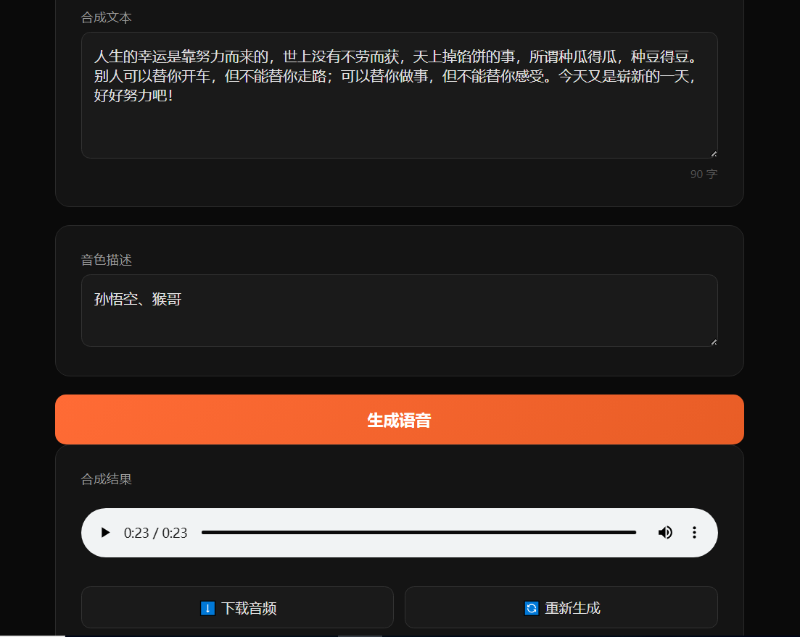

# MiMo TTS Studio

基于 [Xiaomi MiMo-V2.5-TTS](https://mimo.xiaomi.com) API 的语音合成 Web 工具。

提供简洁的网页界面，支持**预置音色**和**音色设计**两种模式，输入文字即可生成高质量语音。

## 界面预览


**预置音色模式**



**音色设计模式**



## 功能

- 🎤 **预置音色** — 8 种中英文音色（冰糖、茉莉、苏打、白桦、Mia、Chloe、Milo、Dean）
- 🎨 **音色设计** — 用自然语言描述任意音色（如"年迈的老先生，语速缓慢，嗓音沙哑"）
- 🎭 **风格/情绪** — 支持自定义风格标签（温柔、开心、悲伤、东北话、唱歌等）
- ⬇️ **音频下载** — 生成后可直接在线播放或下载 WAV 文件
- 🔑 **自带 Key** — 用户输入自己的 API Key，无需服务器存储密钥

## 快速开始

### 1. 获取 API Key

前往 [mimo.xiaomi.com](https://mimo.xiaomi.com) 注册并获取 API Key。

### 2. 安装依赖

```bash
cd tools/tts-website
npm install
```

### 3. 启动服务

```bash
node server.js
```

服务默认运行在 `http://localhost:3456`。

### 4. 使用

1. 在浏览器中打开 `http://localhost:3456`
2. 在顶部输入你的 API Key
3. 输入要合成的文字
4. 选择音色或描述音色
5. 点击「生成语音」

## 项目结构

```
tts-website/
├── server.js          # Node.js 后端（本地部署用）
├── public/
│   └── index.html     # 前端页面（配合 server.js 使用）
├── docs/
│   └── index.html     # 纯静态版本（GitHub Pages 部署用）
├── package.json
└── README.md
```

## 部署到 GitHub Pages

项目提供纯静态版本（`docs/` 目录），可直接部署到 GitHub Pages，无需服务器。

1. 在 GitHub 仓库中进入 **Settings → Pages**
2. **Source** 选择 `Deploy from a branch`
3. **Branch** 选择 `main`，文件夹选择 `/docs`
4. 保存后等待几分钟，访问 `https://akakak47.github.io/tts-website`

> 纯静态版本直接从浏览器调用 MiMo API，用户需自行输入 API Key。

## API 说明

### `POST /api/tts`

**请求体：**

| 字段 | 类型 | 必填 | 说明 |
|------|------|------|------|
| `text` | string | ✅ | 要合成的文字 |
| `apiKey` | string | ✅ | MiMo API Key |
| `model` | string | ❌ | 模型名，默认 `mimo-v2.5-tts`，可选 `mimo-v2.5-tts-voicedesign` |
| `voice` | string | ❌ | 音色名（预置音色模式），默认 `冰糖` |
| `style` | string | ❌ | 风格/情绪描述（预置音色模式） |
| `voiceDesign` | string | ❌ | 音色描述（音色设计模式） |
| `format` | string | ❌ | 音频格式，默认 `wav` |

**响应体：**

```json
{
  "audio": "<base64 编码的音频数据>",
  "format": "wav"
}
```

**错误响应：**

```json
{
  "error": "错误信息"
}
```

## 技术栈

- **后端（本地部署）：** Node.js + Express
- **前端：** 原生 HTML/CSS/JS（无框架依赖）
- **静态部署：** 直接调用 MiMo API（浏览器端，CORS 支持）
- **API：** MiMo-V2.5-TTS（OpenAI 兼容格式）

## License

MIT
